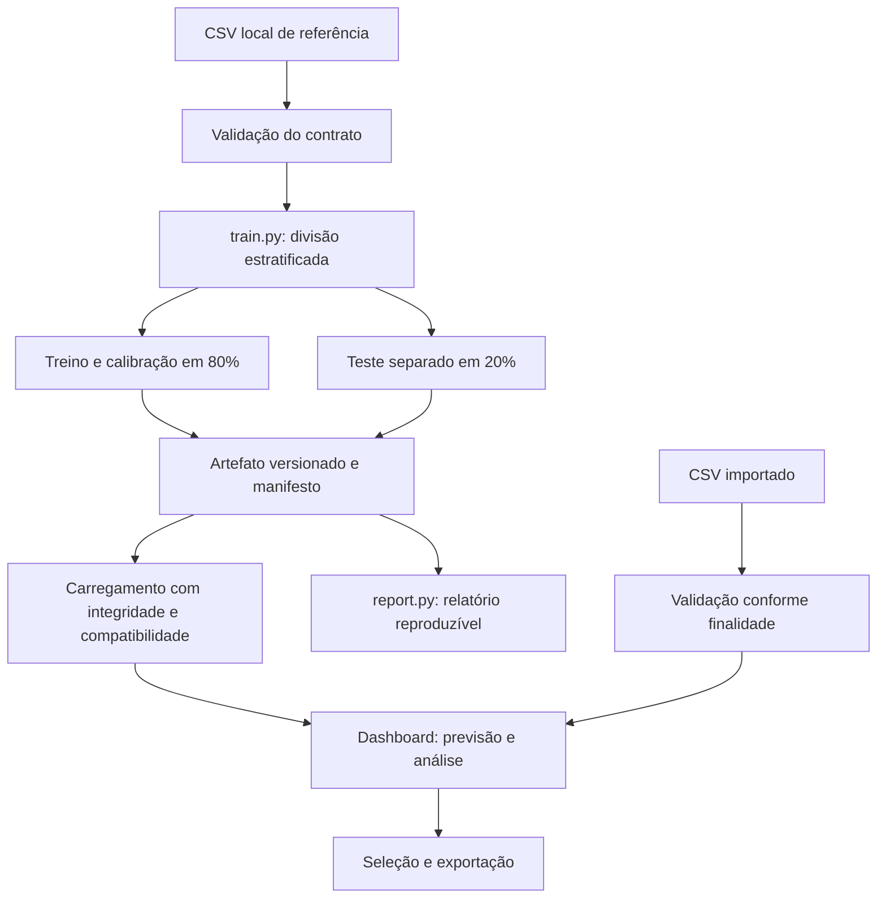

# Arquitetura e decisões técnicas

## Fluxos separados

O diagrama representa os fluxos de dados. O teste fornece métricas ao artefato; não ajusta o estimador. Uploads não chegam ao treinamento.

## Responsabilidades

| Arquivo | Responsabilidade |
|---|---|
| `training.py` | Divisão, pré-processamento, Random Forest, calibração e métricas |
| `artifacts.py` | Gravação de versões, ponteiro ativo, hashes e compatibilidade |
| `model.py` | Carregamento e inferência, sem chamada a fit |
| `validation.py` | Colunas, tipos, valores finitos, categorias e unicidade de IDs |
| `prioritization.py` | Ordenação e seleção pela capacidade informada |
| `comparison.py` | Comparação justa com expectativas das baselines |
| `importing.py` | Previsão e avaliação histórica dos uploads |
| `dashboard.py` e módulos de visualização | Interações e apresentação |
| `report.py` | Evidências derivadas do artefato ativo |

## Decisões para defender na entrevista

- **Capacidade explícita:** evita inventar custos ou usar faixas arbitrárias como regra operacional. Capacidade e público começam vazios.
- **Calibração no treino:** mantém o teste externo fora do ajuste. As métricas do modelo calibrado estão registradas no relatório.
- **Baselines com expectativa exata:** não depende de escolher um sorteio favorável. Valores fracionários representam médias esperadas.
- **Modelo persistido:** abrir a tela ou enviar um CSV não treina. Cada previsão importada exportada identifica sua versão.
- **Falha explícita de contrato:** não há preenchimento automático nem exclusão silenciosa de linhas inválidas.
- **Compatibilidade antes de desserializar:** versões e hash são conferidos. Joblib é carregado apenas de artefatos locais confiáveis; hash não é autenticação.
- **Sobreposição na avaliação importada:** IDs conhecidos desabilitam métricas independentes do arquivo. Novos IDs, por si só, não provam independência.
- **Organização modular:** funções analíticas podem ser testadas sem navegador; testes de interface verificam a integração.

## Limites e próximos passos, ainda não implementados

A implantação atual é local, com Streamlit e arquivos no disco. Não há serviço multiusuário, autenticação, banco de ações de retenção, fila de processamento, monitoramento de drift ou teste de carga. O limite de upload é uma proteção operacional; não é evidência de capacidade medida em produção.

Para escalar, medir primeiro latência, memória e concorrência com uma carga definida. A partir disso, avaliar inferência em serviço separado, processamento em lotes e registro central de modelos. Monitorar qualidade exige dados de produção e resultados observados. Validar temporalmente exige datas. Medir efeito de retenção exige uma campanha e um desenho de avaliação definidos com o negócio.

Esses itens são evolução proposta, não funcionalidades concluídas nem resultados presumidos.
